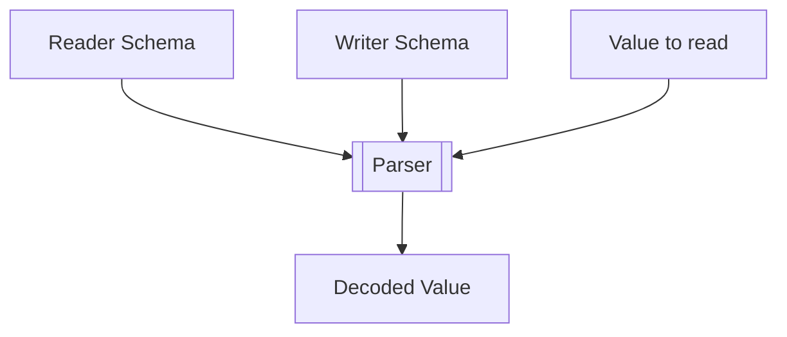
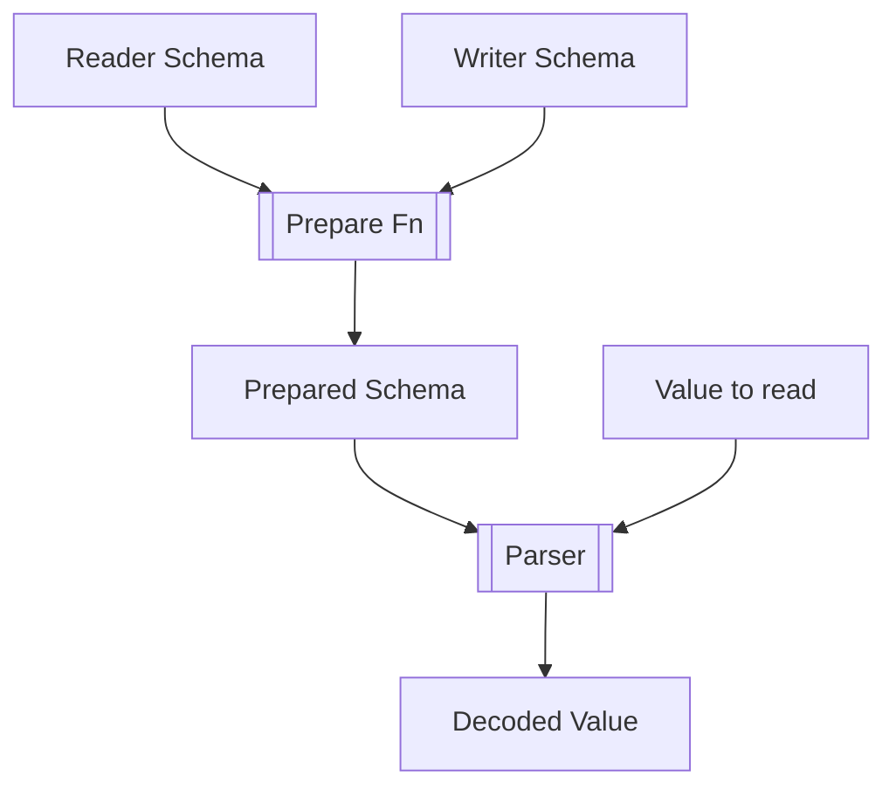

# How cavro Works

Cavro is a [cython](https://cython.readthedocs.io/en/latest/) library.

Before it can be imported into pyhton, the code has to be compiled by cython into a c file `cavro.c`,
and then compiled into a standard python module using _c compiler of choice_.

If you install one of the binary wheels, all this has been done for you already.  Installing from source should be as simple as calling `pip install .` from the root directory, and the process will be run automatically.

# How is cavro different?

Other python avro libraries are structured in a way that can be hard to optimize for speed.  cavro tries to avoid this by employing several principles:

1. Calculate as much up-front as possible (within reason)
2. All encoding/decoding to be done using classes (Taking advantage of vtable call patterns)

## What this means in practice

# Schema

Before any encoding or decoding can happen, the avro schema JSON has to be parsed into a `cavro.Schema` object.

Doing this allows cavro to build up a full encode/decode tree, with type-specific classes for each value to be encoded.

All information required to perform encoding/decoding is extracted from the schema source and stored on the `AvroType` subclass instances up-front.  The schema source is not retained.

The above approach should not sound too profound or novel.  Building up a class-polymorphic parse tree for a data structure is standard practice.  However, by doing it using classes, almost all dict hash-based lookups are avoided, and the c compiler knows how to optimize this type of call pattern really well.

The `Schema` class is technically not required architecturally.  All of the actual logic is done by the thing (`AvroType` subclass) in the `Schema.type` attribute.  The `Schema` class is a wrapper that makes the API a bit nicer, and abstracts some things away.

Each `AvroType` class has methods that can binary/json encode/decode a value from a stream/buffer.  

# Record

If you have a Schema that is complex, for example a union of different record types, and you try to encode a value by passing in a `dict`, the library has to iterate over each of the union types, and see which records have fields that match the data, recursively.  This is always going to be slow to calculate.

It's possible to empoloy short-circuit and early-exit conditions in the union logic, but ultimately the library is performing a linear search over a complex data structure for every value.

With `cavro`, passing dicts as record values is possible, but if you need better performance, the library provides dynamically created classes that represent each record type in the schema.  If you pass an instance of the correct record type to cavro, then encoding can be simplified, and is far faster.

Using record values also helps because field access on record types is much faster than key lookups in a dict.  The optimized code actually doesn't use name-based lookups at all, instead pulling values out of an internal slots mechanism by index.

# Schema resolution/promotion

If you're reading values using a different schema from that used to write values, Avro has a set of rules that can be applied to allow this to happen.

The simple implementation takes in the reader schema, the writer schema, and the value and works out what to do in one go:

But this can be a lot of work, especially in cases where schemas are complex, and unions have to be recursively checked etc.

Instead, it's possible to statically work out the correct parse strategy up-front:

Now, the `prepared schema` can be as fast as any reader schema, because the parse tree is fully resolved.

The advantage here is that the compatibility of reader/writer schemas can be checked up-front too.

# Avoiding Boxes

Another thing that helps us out a lot is avoiding python arithmetic boxing.  A lot of time in Avro parsing is spent reading/writing numbers using zigzag encoding.  As there is no built-in primitive that performs zigzag encoding in python, we have to implement this ourselves.

Performing arithmetic in pure Python (I believe things may be changing on this front, but this has traditionally been true) is quite slow, because intermediate values are boxed (stored behind a pointer).

Let's take a simple chained operation:  `c = (a * 123) + b`.

In C this might compile to assembly that looks a bit like this:

1. Load A
1. Multiply by 123
1. Load B
1. Add together
1. Store result

Which is pretty efficient!

With Python, integers are full objects, not just integer values, and it's hard for the compiler to know if the objects are actually real integers, so you end up with storing and loading each value between each operation.  Our above neat process ends up looking a lot more like this:

1. Create new int object C
1. Increase refcount
1. Load A
1. Extract value from A
1. Multiply value by 123
1. Store result in C
1. Load B
1. Extract value from B
1. Extract value from C
1. Add together
1. Store result in C
1. Clean up refcounts

Not only is this more work to do, lots of the loads and stores are to non-local memory, so the CPU has a much harder time running each operation here.

One of the joys of Cython is that if you give it type information, it can optimize boxing so that all those intermediary stores/loads don't happen, and if you're calling cython code from cython, then temporary objects can be avoided too. You end up with output that looks a lot more like the first one than the second.

